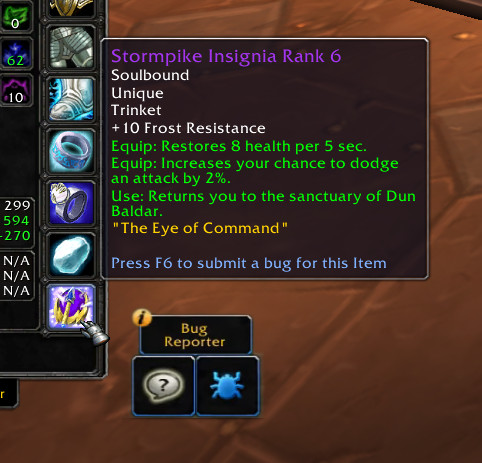

# Make It Classic
So you didn't made it into the beta? With this addon and a little imagination, you can turn your 15 year old gameclient and the entire server you're playing on into an awesome Classic Beta experience! And yes, this might be the most useless addon ever made :'D

## Installation
1. Download **[Latest Version](https://gitlab.com/shagu/MakeItClassic/-/archive/master/MakeItClassic-master.zip)**
2. Unpack the Zip file
3. Rename the folder "MakeItClassic-master" to "MakeItClassic"
4. Copy "MakeItClassic" into Wow-Directory\Interface\AddOns
5. Restart Wow

